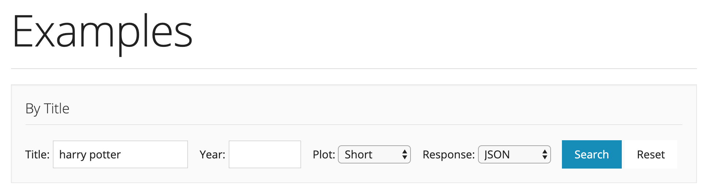
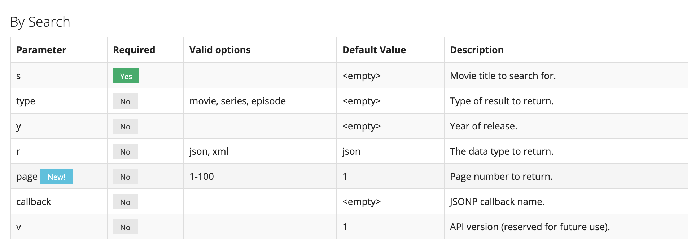
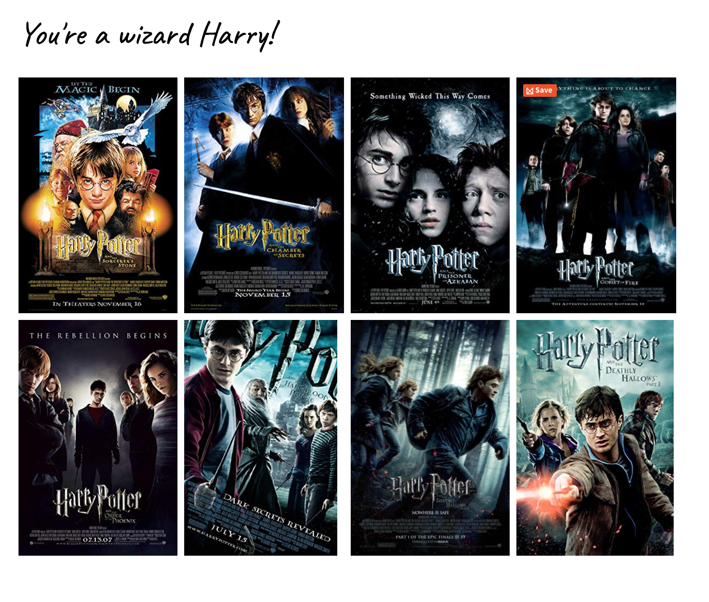

# API Introduction

## What is an API?

An API is the way applications speak to each other.

API calls follow a request/response pattern. We request information and we receive that information as a response. Every time we open a browser, or go to a website we are making a request to a server and what we see is the response from the server.

This week we'll be looking at your personal applications and at other applications and getting information from them. We will be querying others APIs for now but later, when we have our own servers, we will be querying our own.

Typical example of website using an external API of this type is trivago / comparison websites.

## Fetch API

Fetch is a way of making API calls. It takes a url:

```
https://api.github.com/users/chriscoyier/repos
```

The first part (`https://api.github.com`) - domain name - is like the address of a block of flats. The second part (`users/chriscoyier/repos`) is what we call an endpoint; this specifies a specific flat. The fetch function goes to the address that we give it and asks for information at that address.

By default the Fetch API uses the GET method e.g.

```js
fetch('https://api.github.com/users/chriscoyier/repos')
  .then(response => {
    // here we're turning the response into JSON.
    return response.json();
  })
  .then(data => {
    // Here's a list of repos!
    console.log(data);
  })
  .catch(error => {
    console.log(error);
  });
```

Note: There are different HTTP methods other than GET. HTTP (Hypertext Transfer Protocol) is the way data is requested and provided on the internet.

- **GET:** gets resources such as HTML, JS, CSS.
- **POST:** sends data to a server in the body of the request. The type of data is stored in the `Content-Type` header.
- **PUT:** creating or updating data (overwriting data if it already exists).
- **DELETE:** deletes data.

#### JSON

JSON is a lightweight format that allows data to be transferred across the web by using key-value pairs. When we send information between applications it needs to be packaged up, and unpackaged when it is received. We do this using `JSON.stringify()` to package and `JSON.parse()` to unpackage.

### Exercise: write a fetch request that lists your repos

Let's inspect the `response` object we receive in more depth:

- Type/copy the following into the console. Remember to replace `<githubhandle>` with yours:

```js
fetch('https://api.github.com/users/<githubhandle>/repos')
  .then(response => response.json())
  .then(data => console.log(data))
  .catch(error => console.log(error))
```

- Look at the object that comes back. Notice:
  - `Response.body`: the readable stream of the response's body.
  - `Response.headers`: HTTP headers allow the client and the server to pass additional information with the request or the response. An example are status codes.

Status codes tell us if a request was successful. The main groups are:

- 2: Success codes. e.g. `200`
- 3: Redirection e.g. `302`
- 4: Error, Unfound e.g. `404`
- 5: Server Error e.g. `500`

### Exercise: Use Open Movie Database API to fetch Harry Potter films and make a poster gallery.

1. The first task is to make an API call to OMDb movies (in `poster-gallery/script.js`) to get all the Harry Potter information they have. To do this follow the steps below:

We're trying to build a url that looks like this: `http://omdbapi.com/<query>&apiKey=<api-key>`.

- We've got the api domain name: `http://omdbapi.com/`. We now need a query and an API key.
- Get your API key from http://omdbapi.com/apikey.aspx.
- To build your query go to the [documentation](http://omdbapi.com/). Try typing in 'harry potter' into the Examples By Title box to see what the request url looks like.



- Copy and paste this url into your browser and add your API key to the end (`http://www.omdbapi.com/?t=harry+potter&apiKey=<api-key>`). The result should be an object with title 'Harry Potter and the Deathly Hallows Part 2'.
- Play around with the query (`t=harry+potter`) until you get a list of all Harry Potter information. Hint: look at the parameters in the 'By Search' table.



<details>
  <summary>You should expect an array of 10 objects with a Title, Year, imdbID, Type, and Poster property.</summary>

```js
{
  Title: "Harry Potter and the Deathly Hallows: Part 2",
  Year: "2011",
  imdbID: "tt1201607",
  Type: "movie",
  Poster: "https://m.media-amazon.com/images/M/MV5BMjIyZGU4YzUtNDkzYi00ZDRhLTljYzctYTMxMDQ4M2E0Y2YxXkEyXkFqcGdeQXVyNTIzOTk5ODM@._V1_SX300.jpg"
},
{
  Title: "Harry Potter and the Sorcerer's Stone",
  Year: "2001",
  imdbID: "tt0241527",
  Type: "movie",
  Poster: "https://m.media-amazon.com/images/M/MV5BNjQ3NWNlNmQtMTE5ZS00MDdmLTlkZjUtZTBlM2UxMGFiMTU3XkEyXkFqcGdeQXVyNjUwNzk3NDc@._V1_SX300.jpg"
},
{
  Title: "Harry Potter and the Chamber of Secrets",
  Year: "2002",
  imdbID: "tt0295297",
  Type: "movie",
  Poster: "https://m.media-amazon.com/images/M/MV5BMTcxODgwMDkxNV5BMl5BanBnXkFtZTYwMDk2MDg3._V1_SX300.jpg"
},
{
  Title: "Harry Potter and the Prisoner of Azkaban",
  Year: "2004",
  imdbID: "tt0304141",
  Type: "movie",
  Poster: "https://m.media-amazon.com/images/M/MV5BMTY4NTIwODg0N15BMl5BanBnXkFtZTcwOTc0MjEzMw@@._V1_SX300.jpg"
},
{
  Title: "Harry Potter and the Goblet of Fire",
  Year: "2005",
  imdbID: "tt0330373",
  Type: "movie",
  Poster: "https://m.media-amazon.com/images/M/MV5BMTI1NDMyMjExOF5BMl5BanBnXkFtZTcwOTc4MjQzMQ@@._V1_SX300.jpg"
},
{
  Title: "Harry Potter and the Order of the Phoenix",
  Year: "2007",
  imdbID: "tt0373889",
  Type: "movie",
  Poster: "https://m.media-amazon.com/images/M/MV5BMTM0NTczMTUzOV5BMl5BanBnXkFtZTYwMzIxNTg3._V1_SX300.jpg"
},
{
  Title: "Harry Potter and the Deathly Hallows: Part 1",
  Year: "2010",
  imdbID: "tt0926084",
  Type: "movie",
  Poster: "https://m.media-amazon.com/images/M/MV5BMTQ2OTE1Mjk0N15BMl5BanBnXkFtZTcwODE3MDAwNA@@._V1_SX300.jpg"
},
{
  Title: "Harry Potter and the Half-Blood Prince",
  Year: "2009",
  imdbID: "tt0417741",
  Type: "movie",
  Poster: "https://m.media-amazon.com/images/M/MV5BNzU3NDg4NTAyNV5BMl5BanBnXkFtZTcwOTg2ODg1Mg@@._V1_SX300.jpg"
},
{
  Title: "Harry Potter and the Chamber of Secrets",
  Year: "2002",
  imdbID: "tt0304140",
  Type: "game",
  Poster: "https://m.media-amazon.com/images/M/MV5BNTM4NzQ2NjA4NV5BMl5BanBnXkFtZTgwODAwMjE4MDE@._V1_SX300.jpg"
},
{
  Title: "Harry Potter and the Forbidden Journey",
  Year: "2010",
  imdbID: "tt1756545",
  Type: "movie",
  Poster: "https://m.media-amazon.com/images/M/MV5BNDM0YzMyNGUtMTU1Yy00OTE2LWE5NzYtZDZhMTBmN2RkNjg3XkEyXkFqcGdeQXVyMzU5NjU1MDA@._V1_SX300.jpg"
}
],
  totalResults: "80",
  Response: "True"
}
```

</details>

2. Filter out "Harry Potter and the Forbidden Journey" and "Harry Potter and the Chamber of Secrets" type:**game** out of the array.
3. Iterate over the films and sort them by year, from oldest to newest film (Harry Potter and the Sorcerer's Stone to Harry Potter and the Deathly Hallows: Part 2)
4. Iterate over sorted array and create array of poster urls.
5. Add an image tag to the DOM for each of the posters, setting the src to the poster urls. Add a class of "poster" to each element. (The CSS has been done for you). The result should look like this:



```

```
